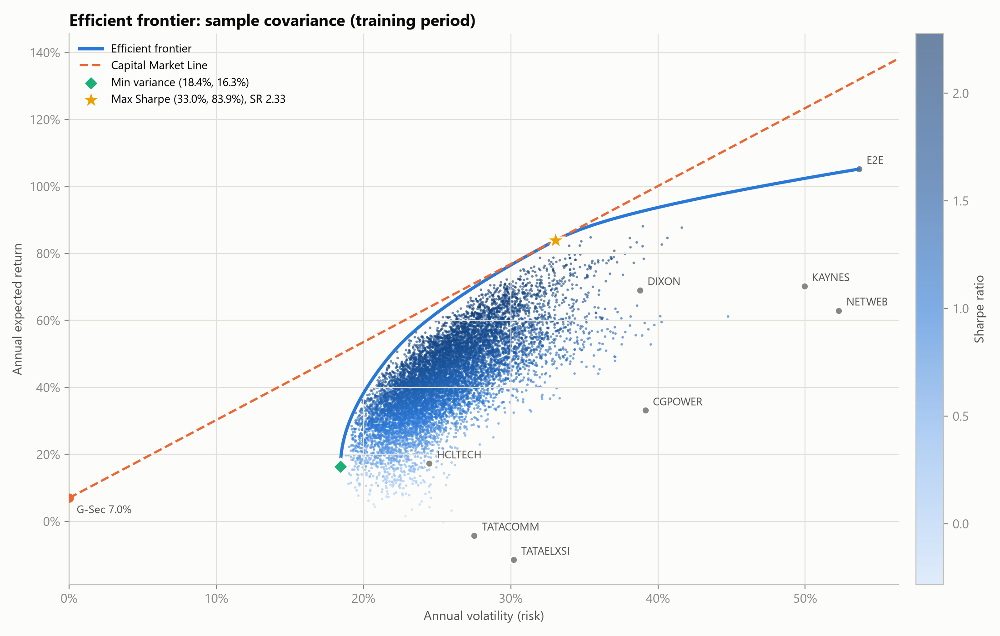
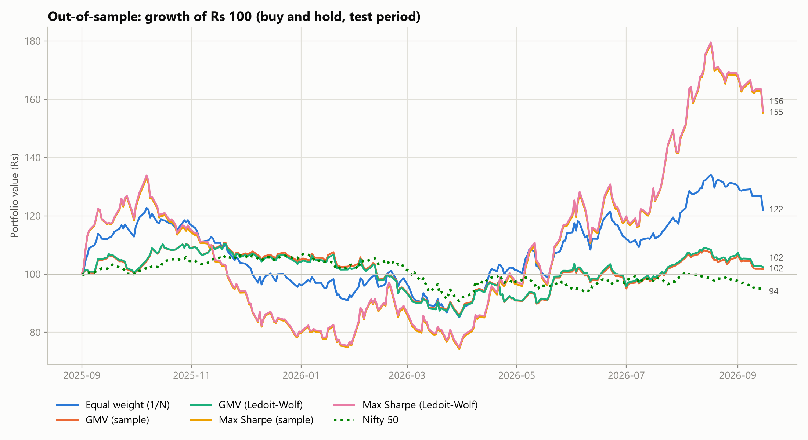
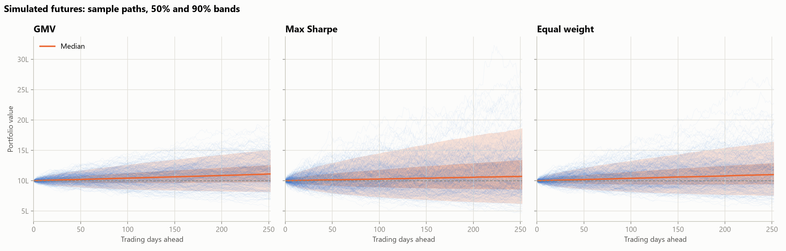
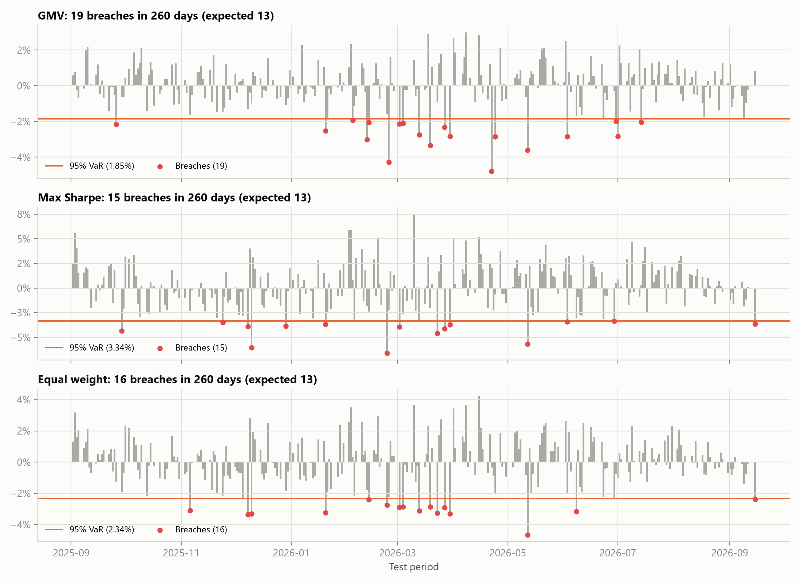
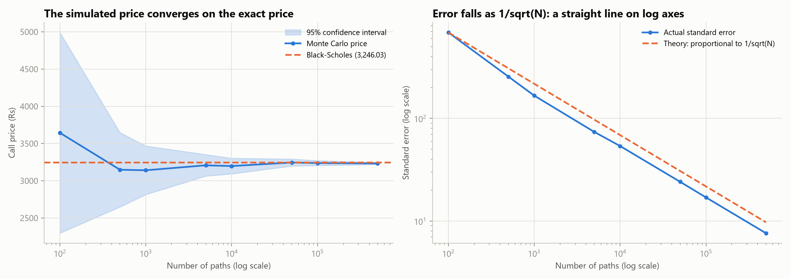
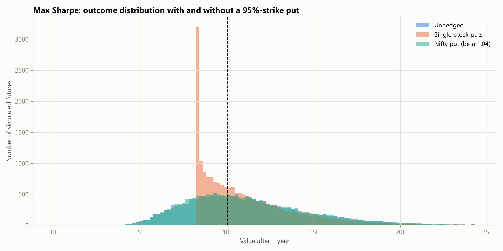
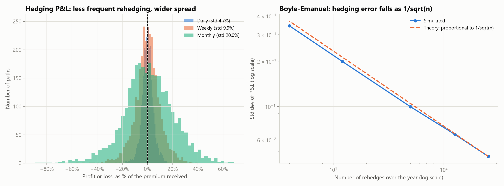

# India's AI & semiconductor supply chain: Markowitz optimisation and Monte Carlo risk

Two connected projects on the same basket of eight NSE-listed stocks.

**Part 1 — Markowitz.** Mean-variance optimisation, Ledoit-Wolf shrinkage, an out-of-sample test and a check against `PyPortfolioOpt`. It answers *which weights should I hold?*

**Part 2 — Monte Carlo.** Simulated futures for those portfolios: Value at Risk, Expected Shortfall, drawdowns, a VaR backtest against the unseen test period, option pricing checked against Black-Scholes, the Greeks, protective puts, and a delta-hedging simulation. It answers *what could happen next, and what would insurance cost?*

An interactive dashboard lets you change the assumptions and watch the answers move.



## The basket

| Layer | Stocks (NSE) |
|---|---|
| Chip design & engineering services | HCLTECH, TATAELXSI |
| Manufacturing, assembly & test (OSAT / EMS) | KAYNES, CGPOWER, DIXON |
| AI compute & cloud | NETWEB, E2E |
| Data centres & connectivity | TATACOMM |

- **Period:** 1 Sep 2023 to 16 Sep 2026, daily adjusted closes from Yahoo Finance
- **Training period:** Sep 2023 to Aug 2025 (491 days); **test period:** Sep 2025 to Sep 2026 (261 days)
- **Risk-free rate:** 7.0%, the 10-year Indian G-Sec yield (about 7.05% on 16 Sep 2026)
- **Constraints:** long-only, fully invested, no weight cap (configurable)

---

# Part 1: Markowitz efficient frontier

## Method

1. **Data:** download, cache to CSV, and check for missing values, late listings and unadjusted splits (no one-day move exceeded 25%)
2. **Estimates:** simple daily returns → annual mean (×252) and covariance (×252)
3. **Frontier:** minimise wᵀΣw subject to wᵀμ = target, Σw = 1, w ≥ 0, solved with SciPy SLSQP at 60 target returns
4. **Special portfolios:** Global Minimum Variance (GMV) and Maximum Sharpe (tangency), plus the Capital Market Line
5. **Visual check:** 10,000 random Dirichlet-weighted portfolios (none beats the tangency Sharpe ratio)
6. **Robustness:** repeat with the Ledoit-Wolf (2004) shrinkage covariance matrix
7. **Out-of-sample test:** buy-and-hold every portfolio over the test period, compared with equal weight (1/N) and the Nifty 50
8. **Validation:** weights match `PyPortfolioOpt` to within 0.0001%

## Results

**Training period (in-sample):**

| Portfolio | Exp. return | Volatility | Sharpe | Main holdings |
|---|---|---|---|---|
| Min variance | 16.3% | 18.4% | 0.51 | HCLTECH 40%, TATACOMM 24%, TATAELXSI 16% |
| Max Sharpe | 83.9% | 33.0% | 2.33 | DIXON 43%, E2E 42%, KAYNES 10% |

**Test period (out-of-sample, buy and hold):**

| Portfolio | Total return | Volatility | Sharpe | Max drawdown |
|---|---|---|---|---|
| Equal weight (1/N) | +22.0% | 25.9% | 0.55 | −30.6% |
| GMV (sample) | +1.7% | 19.5% | −0.27 | −22.5% |
| GMV (Ledoit-Wolf) | +2.4% | 19.5% | −0.24 | −22.6% |
| Max Sharpe (sample) | +55.4% | 40.5% | 1.14 | −44.2% |
| Max Sharpe (Ledoit-Wolf) | +55.9% | 40.6% | 1.15 | −44.2% |
| Nifty 50 | −6.1% | 12.9% | −1.00 | −15.2% |



## Findings

1. **Correlations were lower than expected.** I expected the AI-themed names to move together, but average pairwise correlation is only 0.15 to 0.29. The highest pair is Kaynes/Dixon (0.50), and Netweb/E2E is 0.33. The GMV portfolio's volatility (18.4%) is below that of every individual stock, so the diversification benefit is real.
2. **Risk and return pull in opposite directions.** The GMV portfolio relies on the steady names (HCL Tech, Tata Comm, Tata Elxsi), even though two of them had negative returns in the training period, because they are low-volatility and weakly correlated with the rest. The tangency portfolio concentrates in the training period's winners, with an effective number of holdings of only 2.7.
3. **Shrinkage made little difference here.** The Ledoit-Wolf intensity was 0.048: with 491 observations for 8 stocks, the sample covariance matrix is already well estimated. Shrinkage matters when the number of stocks is large relative to the history available.
4. **Expected returns are the weak link.** Every portfolio fell well short of its predicted return (tangency: 84% predicted, 53% realised). This matches the well-known result that estimation error in μ dominates estimation error in Σ (Chopra & Ziemba, 1993).
5. **The tangency portfolio's outperformance came from one stock.** E2E rose 155% in the test period, while Dixon (−25%) and Kaynes (−49%), the tangency portfolio's other main holdings, fell. The result reflects one concentrated bet paying off rather than evidence that the optimisation works.
6. **GMV did what it is designed to do:** it had the lowest volatility and the smallest drawdown of the stock portfolios.

---

# Part 2: Monte Carlo risk, option pricing and hedging



## Method

1. **Expected returns.** Three choices, because this assumption drives everything: historical averages, CAPM (rf + β × 5.5% equity risk premium, the default), or a flat rf + premium. The covariance matrix is left as estimated in all three cases.
2. **Simulation.** Correlated geometric Brownian motion, with independent shocks turned into correlated ones by the Cholesky factor of Σ. 20,000 paths × 252 daily steps, buy and hold, ₹10 lakh invested. The Nifty 50 is simulated alongside the stocks at a weight of zero, so the index hedge in step 5 moves realistically against the basket.
3. **Risk metrics.** VaR and CVaR (Expected Shortfall) at 95% and 99%, the distribution of maximum drawdown *within* each path, and the probabilities of losing money or beating the risk-free rate.
4. **Model checking.** GBM VaR against historical VaR at 1-day and 10-day horizons, then a backtest counting how often the unseen test period broke the model's 95% VaR.
5. **Option pricing.** European options priced by simulation and checked against Black-Scholes, a convergence study showing error falling as 1/√N, and an Asian option, which has no closed-form price. Greeks by bump-and-revalue with common random numbers, plus a pathwise delta, both verified against the analytic Greeks.
6. **Hedging.** Protective puts two ways: one put per stock, and a single beta-sized Nifty put. Several strikes compared on CVaR reduction per rupee of premium.
7. **Delta hedging.** Selling a one-year at-the-money call and rehedging at fixed intervals, measuring the hedging error against the 1/√n law and the P&L when realised volatility differs from the volatility charged.

## Results

**Risk over one year (CAPM expected returns, ₹10 lakh, 20,000 paths):**

| Portfolio | Expected return | VaR 95% | CVaR 95% | P(loss) | Median max drawdown |
|---|---|---|---|---|---|
| GMV | 12.2% | 18.4% | 24.2% | 29% | −15.1% |
| Max Sharpe | 12.7% | 37.8% | 45.1% | 42% | −28.4% |
| Equal weight | 12.9% | 24.3% | 30.8% | 34% | −19.6% |

**Does the model hold up?**

| Portfolio | GBM 1-day VaR | Historical 1-day | GBM 10-day (99%) | Historical 10-day (99%) | Breaches of 95% VaR in the test period |
|---|---|---|---|---|---|
| GMV | 1.85% | 1.71% | 7.80% | 8.91% | 19 (13 expected) |
| Max Sharpe | 3.34% | 3.01% | 13.95% | 20.65% | 15 (13 expected) |
| Equal weight | 2.34% | 2.34% | 9.87% | 13.47% | 16 (13 expected) |



**Option pricing** (Dixon, spot ₹17,574, 38.8% historical volatility, 1 year, at the money):

| | Price | Note |
|---|---|---|
| Black-Scholes call | ₹3,246.03 | exact |
| Monte Carlo call (500,000 paths) | ₹3,247.68 ± 15.02 | within the confidence interval |
| Asian call (100,000 paths) | ₹1,815.20 | 44% cheaper; no closed form exists |

Delta from simulation is 0.6452 against the exact 0.6460; gamma and vega match to three significant figures once common random numbers are used.



**Hedging the Max Sharpe portfolio** (1-year puts, 95% strike, premium financed at the risk-free rate):

| | Premium | Mean return | VaR 95% | CVaR 95% |
|---|---|---|---|---|
| Unhedged | — | 13.6% | 37.8% | 45.1% |
| Puts on each stock | 12.33% | 11.9% | 18.2% | 18.2% |
| One Nifty put (β = 1.04) | 1.27% | 12.9% | 37.6% | 44.6% |



**Delta hedging a short call** (P&L as a percentage of the premium received):

| Rehedge every | Rehedges | Mean P&L | Std dev |
|---|---|---|---|
| Day | 252 | −0.00% | 4.66% |
| Week | 50 | −0.00% | 9.95% |
| Month | 12 | +0.62% | 19.99% |



## Findings

1. **The drift assumption dominates every risk number.** With the training-period averages, the Max Sharpe portfolio is simulated at an 84% expected return and losses look unlikely. With CAPM returns it is 12.7% and the probability of losing money over a year is 42%. Same weights, same covariance matrix, same code. This is Chopra & Ziemba's result showing up in practice, and it is why the dashboard warns you when the historical drift is selected.
2. **GBM understates the tails, and the backtest shows where.** One-day VaR is close to the historical figure for every portfolio, but the 10-day 99% VaR is badly too small — 13.95% against 20.65% for the Max Sharpe portfolio. Real losses cluster: a model of independent normal shocks cannot produce that. Every portfolio breached its 95% VaR more often than the 5% of days allowed.
3. **VaR alone hides the size of the tail.** The Max Sharpe portfolio's 95% VaR is 37.8%, but the average loss *given* a breach is 45.1%. CVaR is the number worth quoting, and it is the one Basel moved to for market risk.
4. **Matching Black-Scholes is what licenses the rest.** The simulated European call lands within its confidence interval of the exact price, the error falls as a straight line on log-log axes, and the simulated Greeks match the analytic ones. Only after that check is it reasonable to trust the same engine on an Asian option, where there is nothing to check against.
5. **The cheap hedge is cheap for a reason.** Puts on the eight stocks cost 12.3% of the portfolio and floor the loss at 18.2%. A beta-sized Nifty put costs 1.3% and moves CVaR by less than half a percentage point, because this basket's correlation with the index is too low for the index to stand in for it. That gap is basis risk, quantified.
6. **Discrete delta hedging behaves exactly as the theory says.** Weekly rehedging roughly doubles the error of daily rehedging, and monthly roughly doubles it again, following 1/√n (Boyle & Emanuel, 1980). The mean P&L stays at zero throughout: hedging less often is noisier, not biased. Change the realised volatility away from the volatility charged and the mean moves immediately, which is the sense in which selling options is a bet on volatility rather than direction.

## Limitations

- **Normal returns.** GBM has no fat tails, no volatility clustering and no jumps. Student-t innovations, GARCH or a jump-diffusion model would each address this, at the cost of more parameters to estimate and defend.
- **Constant volatility and correlation,** estimated once on the training window. Both rise together in a crash, which is exactly when a hedge is needed.
- **Historical volatility in place of implied.** Free implied-volatility data for NSE options is not readily available, so options here are priced off past volatility rather than what the market charges.
- **European exercise, no dividends, no transaction costs or taxes, and perfectly divisible index puts.**
- **A single train/test split** with a one-year test period; a rolling-window study would be more reliable.
- **Selection bias:** the basket was chosen in 2026 with knowledge of the AI theme.

## Possible extensions

- Student-t or GARCH innovations, to give the simulation realistic tails
- Black-Litterman returns (market-implied equilibrium plus analyst views)
- Variance reduction beyond antithetic paths: control variates and quasi-Monte Carlo (Sobol sequences)
- A rolling or expanding-window backtest with monthly rebalancing
- Hierarchical Risk Parity

---

## The dashboard

Five tabs, driven by the sidebar (portfolio, drift assumption, horizon, number of paths, confidence level, random seed):

| Tab | What you can do |
|---|---|
| **Portfolio risk** | Simulate any of the three portfolios; see the fan chart, outcome distribution, VaR/CVaR, drawdowns, and the VaR backtest |
| **Option pricer** | Price European and Asian calls and puts on any of the eight stocks, against Black-Scholes, with the convergence study |
| **Greeks** | Compare simulated Greeks with the exact ones, and see how each Greek changes with the spot price |
| **Protective put** | Compare single-stock puts with a beta-sized Nifty put at several strikes, with payoff diagrams |
| **Delta hedging** | Rehedge daily to quarterly, change the realised volatility, and watch the hedging error follow 1/√n |

Run it locally:

```powershell
.venv\Scripts\streamlit.exe run app.py
```

## How to run

```powershell
python -m venv .venv
.venv\Scripts\python.exe -m pip install -r requirements.txt
.venv\Scripts\python.exe -m pip install -r requirements-notebooks.txt
```

`requirements.txt` holds what the dashboard needs, which is also what Streamlit Community Cloud installs. `requirements-notebooks.txt` adds the packages only the notebooks use (`yfinance`, `PyPortfolioOpt`, `seaborn`, `ipykernel`).

Open either notebook in VS Code, select the `.venv` kernel and click **Run All**. Prices are loaded from `data/`; delete those CSV files to download fresh data. `monte_carlo.ipynb` takes about 90 seconds to run end to end.

## Files

| File | Purpose |
|---|---|
| `markowitz_frontier.ipynb` | Part 1: the efficient frontier, shrinkage and the out-of-sample test |
| `monte_carlo.ipynb` | Part 2: simulation, risk metrics, option pricing, Greeks and hedging |
| `portfolio.py` | Part 1's engine: data, estimates, optimiser, backtest |
| `simulation.py` | Part 2's engine: GBM paths, risk metrics, Black-Scholes, Monte Carlo pricing and Greeks, hedging |
| `app.py` | The Streamlit dashboard |
| `build_notebook.py`, `build_mc_notebook.py` | Regenerate the notebooks if needed |
| `data/` | Cached price data (for reproducibility) |
| `outputs/` | Saved charts |

## References

- Markowitz, H. (1952). Portfolio Selection. *Journal of Finance*, 7(1), 77–91.
- Black, F. & Scholes, M. (1973). The Pricing of Options and Corporate Liabilities. *Journal of Political Economy*, 81(3), 637–654.
- Boyle, P. (1977). Options: A Monte Carlo Approach. *Journal of Financial Economics*, 4(3), 323–338.
- Boyle, P. & Emanuel, D. (1980). Discretely Adjusted Option Hedges. *Journal of Financial Economics*, 8(3), 259–282.
- Michaud, R. (1989). The Markowitz Optimization Enigma: Is 'Optimized' Optimal? *Financial Analysts Journal*, 45(1), 31–42.
- Chopra, V. & Ziemba, W. (1993). The Effect of Errors in Means, Variances, and Covariances on Optimal Portfolio Choice. *Journal of Portfolio Management*, 19(2), 6–11.
- Ledoit, O. & Wolf, M. (2004). A well-conditioned estimator for large-dimensional covariance matrices. *Journal of Multivariate Analysis*, 88(2), 365–411.
- Glasserman, P. (2003). *Monte Carlo Methods in Financial Engineering*. Springer.
- Jorion, P. (2006). *Value at Risk: The New Benchmark for Managing Financial Risk*. 3rd ed. McGraw-Hill.
- DeMiguel, V., Garlappi, L. & Uppal, R. (2009). Optimal Versus Naive Diversification. *Review of Financial Studies*, 22(5), 1915–1953.
- Basel Committee on Banking Supervision (2019). *Minimum Capital Requirements for Market Risk*.
